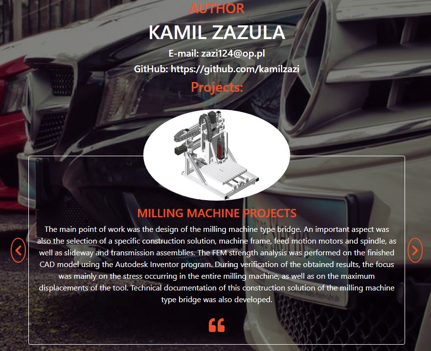

# Website about my mechanical projects

##### Mini app with JavaScript, HTML and CSS

## Tables of Contents   
* General info
* Technologies
* Setup
* Sources
* Contact

### General info
This website was made to fix JavaScript, HTML and CSS in my brain.

### Technologies
* JavaScript
* HTML 5
* CSS

### Setup
To use this project follow these steps:

1. Open index.html in your web browser

### Sources
This web is inspired by GitHub user romeojeremiah in respect of Testimonials-Project. 

### Contact
Kamil Zazula - feel free to contact me!
>
> GitHub [@kamilzazi](https://github.com/kamilzazi) &nbsp;&middot;&nbsp;
> e-mail [zazi124@op.pl]()